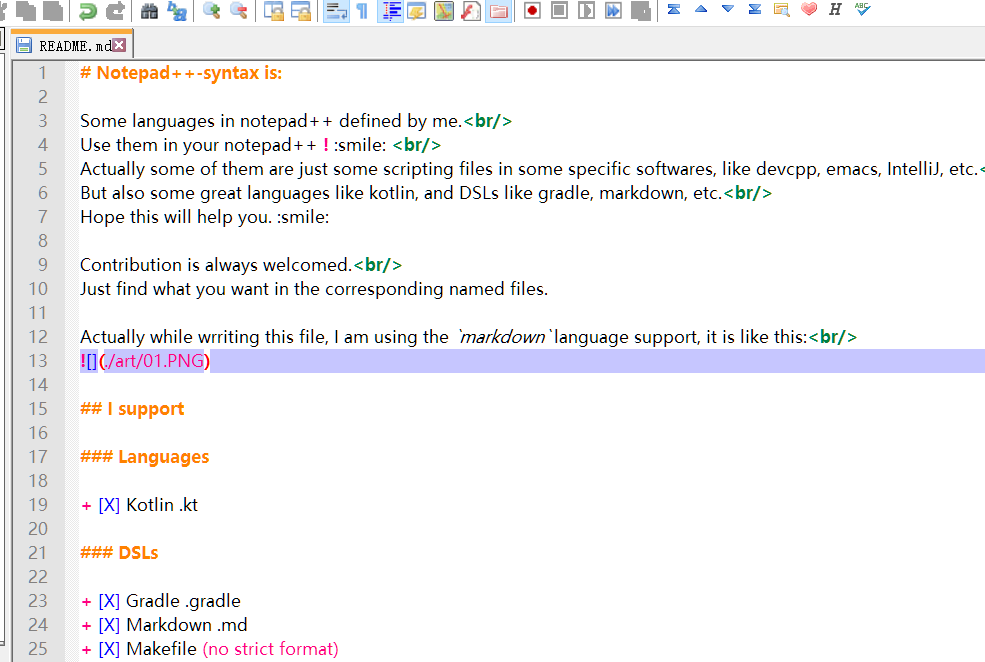
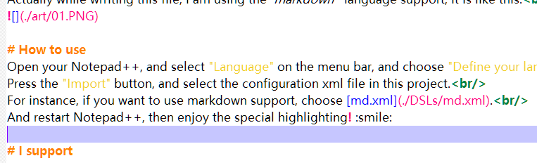

# Notepad++-syntax is:

Some languages in Notepad++ defined by me. 
Use them in your Notepad++ ! :smile:  
Actually some of them are just some scripting files in some specific softwares, like devcpp, emacs, IntelliJ, etc. 
But also some great languages like kotlin, and DSLs like gradle, markdown, etc. 
Hope this will help you. :smile:

Contribution is always welcomed. 
Just find what you want in the corresponding named files.

Actually while wrriting this file, I am using the `markdown`  language support, it is like this: 

# How to use
Open your Notepad++, and select "Language" on the menu bar, and choose "Define your language". 
Press the "Import" button, and select the configuration xml file in this project. 
For instance, if you want to use markdown support, choose [md.xml](./DSLs/md.xml). 
And restart Notepad++, then enjoy the special highlighting! :smile:

# I support

### Languages

+ [X] Kotlin 
> [.kt](./languages/kt.xml)

### DSLs

+ [X] Gradle 
> [.gradle](./DSLs/gradle.xml)

+ [X] Markdown 
> [.md](./DSLs/md.xml)

+ [X] Makefile 
> (no strict format)

+ [X] Solution 
> [.sln](./DSLs/sln.xml)

### Scripting files for :

+ [X] Emacs 
> [.info](./scripting/emacs/info.xml)

+ [X] Dev C++ 
> [.lng](./scripting/devcpp/lng.xml)  
[.tips](./scripting/devcpp/tips.xml)  
[.map](./scripting/devcpp/map.xml)

+ [X] InelliJ IDEA 
> [.number](./scripting/intellij/number.xml)  
[.policy](./scripting/intellij/policy.xml)
