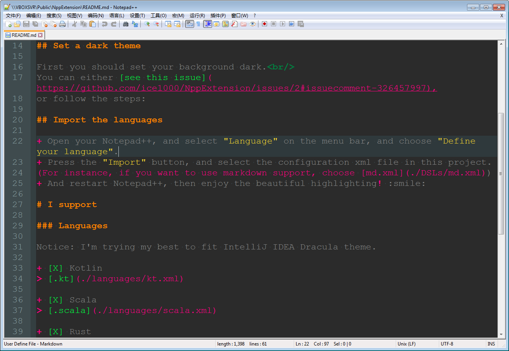

# Notepad++-syntax

Some languages' highlight config in Notepad++. 

Hope this tool will help you. :smile:

Contribution is always welcomed. 
Just find what you want in the corresponding named files.

# How to use

## Set a dark theme

First you should set your background dark. 
You can either [see this issue](https://github.com/ice1000/NppExtension/issues/2#issuecomment-326457997),
or follow the steps:

+ Open your Notepad++, and select "Settings" on the menu bar, and choose "Style configurator".
+ Select theme "Obsidian" (you can choose other dark themes)
+ Go to "Global Styles" -> "Global override", click the "background color"
+ Click "more colors", and use: "red: 43, blue: 43, green: 43" (which is 0x2B2B2B)
+ Check the "Enable global background color" option.

## Import the languages

+ Open your Notepad++, and select "Language" on the menu bar, and choose "Define your language".
+ Press the "Import" button, and select the configuration xml file in this project.
(For instance, if you want to use markdown support, choose [md.xml](./DSLs/md.xml))
+ And restart Notepad++, then enjoy the beautiful highlighting! :smile:

# Languages supported

Notice: I'm trying my best to fit IntelliJ IDEA Dracula theme.

+ [X] Kotlin
> [.kt](./languages/kt.xml)

+ [X] Scala
> [.scala](./languages/scala.xml)

+ [X] Rust
> [.rs](./languages/rs.xml)

+ [X] Lice
> [.lice](./languages/lice.xml)

+ [X] Gradle
> [.gradle](./DSLs/gradle.xml)

+ [X] Markdown
> [.md](./DSLs/md.xml)

+ [X] Makefile
> [no strict format](./DSLs/make.xml)

+ [X] Solution
> [.sln](./DSLs/sln.xml)

+ [X] My own backend DSL
> [.txt](./DSLs/txt.xml)
